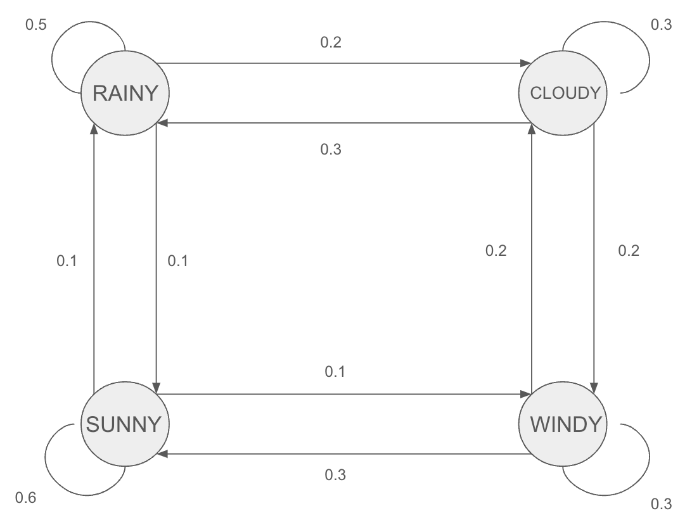

```{r setup, include=FALSE}
knitr::opts_chunk$set(echo = FALSE)
```

## Order Statistics

To derive the order statistics, we follow a general procedure:

1.  Find the probability density function for the distribution $f(x)$.

2.  Calculate the cumulative density function for the distribution $F(x)$.

3.  For $k^{th}$ statistics $X_{(k)}$, there must be $k-1$ samples less than $X_{(k)}$, a sample equals to $X_{(k)}$, and $n-k$ samples larger than $X_{(k)}$.

-   The probability $k-1$ samples less than $X_{(k)}$: $F(x)^{k-1}$

-   The probability a sample equals to $X_{(k)}$: $f(x)$

-   The probability $n-k$ samples larger than $X_{(k)}$: $[1-F(x)]^{n-k}$

-   Select $k-1$ sample out of $n$ to be less than $x$ is $\binom{n}{k-1}$

4.  Multiply all the terms we get the a gereral probability density function of $X_{(k)} = \binom{n}{k-1}F(x)^{k-1}f(x)[1-F(x)]^{n-k}$

### 1. Uniform Distirbution

Probability density function: $f(x) = \frac{1}{b-a}$ for $a≤x≤b$

Cumulative density function: $F(x) = \int_{a}^{x} f(t) \, dt = \int_{a}^{x} \frac{1}{b-a} \, dt = \frac{x-a}{b-a}$

Probability density function of $X_{(k)}$: $f(X_{(k)}) = \frac{n!}{(k-1)!(n-k)!}(\frac{x-a}{b-a})^{k-1}(1-\frac{x-a}{b-a})^{n-k}\frac{1}{b-a}$

Min: $f(X_{(1)}) = \frac{n}{b-a}(\frac{b-x}{b-a})^{n-1}$

Max: $f(X_{(n)}) = \frac{n}{b-a}(\frac{x-a}{b-a})^{n-1}$

Mean: $f(X_{(n/2)}) = \frac{n!}{(n/2-1)!(n/2)!}(\frac{x-a}{b-a})^{n/2-1}(1-\frac{x-a}{b-a})^{n/2}\frac{1}{b-a}$

25 quantile: $f(X_{(n/4)}) = \frac{n!}{(n/4-1)!(3n/4)!}(\frac{x-a}{b-a})^{n/4-1}(1-\frac{x-a}{b-a})^{3n/4}\frac{1}{b-a}$

75 quantile: $f(X_{(3n/4)}) = \frac{n!}{(3n/4-1)!(n/4)!}(\frac{x-a}{b-a})^{3n/4-1}(1-\frac{x-a}{b-a})^{n/4}\frac{1}{b-a}$

### 2. Exponatial Distribution

Probability density function: $f(x) = \lambda e^{-\lambda x}$ for $x≥0$

Cumulative density function: $F(x) = \int_{0}^{x}\lambda e^{-\lambda t} \, dt = 1-e^{\lambda x}$

Probability density function of $X_{(k)}$: $f(X_{(k)}) = \frac{n!}{(k-1)!(n-k)!}(1-e^{\lambda x})^{k-1}\lambda e^{-\lambda x}(e^{\lambda x})^{n-k} = \frac{n!}{(k-1)!(n-k)!}e^{-\lambda nx}x^{k-1}$

Min: $f(X_{(1)}) = ne^{-\lambda nx}$

Max: $f(X_{(n)}) = ne^{-\lambda nx}x^{n-1}$

Mean: $f(X_{(n/2)}) = \frac{n!}{(n/2-1)!(n/2)!}e^{-\lambda nx}x^{n/2-1}$

25 quantile: $f(X_{(n/4)}) = \frac{n!}{(n/4-1)!(3n/4)!}e^{-\lambda nx}x^{n/4-1}$

75 quantile: $f(X_{(3n/4)}) = \frac{n!}{(3n/4-1)!(n/4)!}e^{-\lambda nx}x^{3n/4-1}$

### 3. Normal Distribution

Probability density function: $f(x | \mu, \sigma^2) = \frac{1}{\sigma \sqrt{2\pi}} e^{-\frac{1}{2} \left(\frac{x - \mu}{\sigma}\right)^2}$

Cumulative density function: - For standard normal distribution: $\Phi(x) = \frac{1}{\sqrt{2\pi}} \int_{-\infty}^{x} e^{-\frac{t^2}{2}} dt$

-   Cumulative density function for general normal distribution: $F(x) = \Phi(\frac{x-\mu}{\sigma})$

Probability density function of $X_{(k)}$: $f(X_{(k)}) = \frac{n!}{(k-1)!(n-k)!}(\Phi(\frac{x-\mu}{\sigma}))^{k-1}\frac{1}{\sigma \sqrt{2\pi}} e^{-\frac{1}{2} \left(\frac{x - \mu}{\sigma}\right)^2}(1-\Phi(\frac{x-\mu}{\sigma}))^{n-k}$

Min: $f(X_{(1)}) = n\frac{1}{\sigma \sqrt{2\pi}} e^{-\frac{1}{2} \left(\frac{x - \mu}{\sigma}\right)^2}(1-\Phi(\frac{x-\mu}{\sigma}))^{n-1}$

Max: $f(X_{(n)}) = n\frac{1}{\sigma \sqrt{2\pi}} e^{-\frac{1}{2} \left(\frac{x - \mu}{\sigma}\right)^2}(\Phi(\frac{x-\mu}{\sigma}))^{n-1}$

Mean: $f(X_{(n/2)}) = \frac{n!}{(n/2-1)!(n/2)!}(\Phi(\frac{x-\mu}{\sigma}))^{n/2-1}\frac{1}{\sigma \sqrt{2\pi}} e^{-\frac{1}{2} \left(\frac{x - \mu}{\sigma}\right)^2}(1-\Phi(\frac{x-\mu}{\sigma}))^{n/2}$

25 quantile: $f(X_{(n/4)}) = \frac{n!}{(n/4-1)!(3n/4)!}(\Phi(\frac{x-\mu}{\sigma}))^{n/4-1}\frac{1}{\sigma \sqrt{2\pi}} e^{-\frac{1}{2} \left(\frac{x - \mu}{\sigma}\right)^2}(1-\Phi(\frac{x-\mu}{\sigma}))^{3n/4}$

75 quantile: $f(X_{(3n/4)}) = \frac{n!}{(3n/4-1)!(n/4)!}(\Phi(\frac{x-\mu}{\sigma}))^{3n/4-1}\frac{1}{\sigma \sqrt{2\pi}} e^{-\frac{1}{2} \left(\frac{x - \mu}{\sigma}\right)^2}(1-\Phi(\frac{x-\mu}{\sigma}))^{n/4}$

## Markov Chain in Weather Forecasting

We know intuitively that if today is rainy then there is a good chance tomorrow will be rainy too. We might also expect it to be fairly likely to be cloudy, with only a small chance of being sunny. We can make similar judgements about what tomorrow's weather will be like if it is cloudy or sunny today.

It can be present in a transition matrix:

| WEATHER TODAY | P(RAINY) | P(CLOUDY) | P(SUNNY) | P(WINDY) |
|:-------------:|:--------:|:---------:|:--------:|:--------:|
|     RAINY     |   0.5    |    0.2    |   0.1    |   0.2    |
|    CLOUDY     |   0.3    |    0.3    |   0.2    |   0.2    |
|     SUNNY     |   0.1    |    0.2    |   0.6    |   0.1    |
|     WINDY     |   0.3    |    0.2    |   0.3    |   0.2    |

For example if today is sunny then there is a 10% chance of it being rainy tomorrow, 20% chance of it being cloudy, 60% chance of it being sunny again, and 10% chance of it being windy.

Graph representation:

 R simulation:

Assume the first day is a sunny day, predict weather of the following 14 days.

```{r}
states <- c("RAINY", "CLOUDY", "SUNNY", "WINDY")
transition_matrix <- matrix(c(
  0.5, 0.2, 0.1, 0.2,
  0.3, 0.3, 0.2, 0.2,
  0.1, 0.2, 0.6, 0.1,
  0.3, 0.2, 0.3, 0.2
), nrow = 4, byrow = TRUE)

colnames(transition_matrix) <- states
rownames(transition_matrix) <-states


forecast_next_day <- function(current_state, transition_matrix) {

  state_index <- match(current_state, rownames(transition_matrix))
  
  sample(rownames(transition_matrix), size = 1, prob = transition_matrix[state_index, ])
}

current_weather <- "SUNNY"

# Forecast for the next 14 days
forecast <- vector("character", length = 14)
for (i in 1:14) {
  next_day_weather <- forecast_next_day(current_weather, transition_matrix)
  forecast[i] <- next_day_weather
  current_weather <- next_day_weather
}

forecast
```

## Irrigation Problem

To calculate the speed of the outer wheel, we use the formula:$$v = \frac{2\pi r}{t}$$

The radius (r) is 1320 feet, and time is recorded in the .txt file, we measure the speed in feet per second

```{r}
data = read.table("rotation_time.txt")
vector_data <- unlist(data)
speed_data = 2*pi*1320/(vector_data*3600)
mean_value <- mean(speed_data)
se <- sd(speed_data) / sqrt(length(speed_data))

# Calculate the 90% confidence interval
alpha <- 1 - 0.90
z <- qt(1 - alpha / 2, df = length(speed_data) - 1)
lower <- mean_value - z * se
upper <- mean_value + z * se

ci <- c(lower, upper)
print(ci)
```

The 90% confidence interval for the speed is [0.09963162,0.10269894] feet/s.
